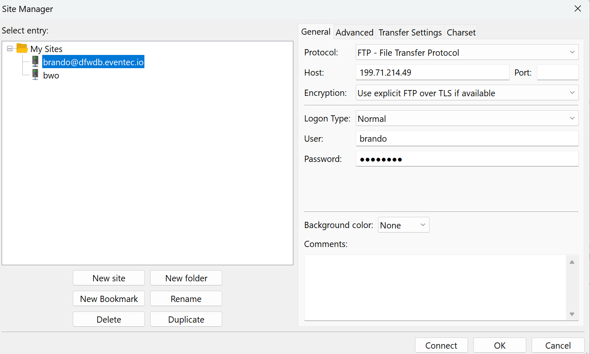

# Dfwdb FTP server setup

```bash
sudo apt update
sudo apt install vsftpd
sudo cp /etc/vsftpd.conf /etc/vsftpd.conf.bak
## open ports
sudo ufw allow 20/tcp
sudo ufw allow 21/tcp
sudo ufw allow 990/tcp
sudo ufw allow 40000:50000/tcp
## check ports
sudo ufw status
sudo ufw enable ## if not already enabled
## creatftp user
sudo mkdir /home/brando/ftp
sudo chown nobody:nogroup /home/brando/ftp
sudo chmod a-w /home/brando/ftp
sudo mkdir /home/brando/ftp/files
sudo chown brando /home/brando/ftp/files
echo "This is a test file" | sudo tee /home/brando/ftp/files/test.txt
## create public and privite key for ssl
sudo openssl req -x509 -nodes -days 365 -newkey rsa:2048 -keyout /etc/ssl/private/vsftpd.pem -out /etc/ssl/private/vsftpd.pem

## edit conf file
sudo nano /etc/vsftpd.conf
## change the entire file to the following:
listen_ipv6=YES
anonymous_enable=NO
local_enable=YES
write_enable=YES
dirmessage_enable=YES
use_localtime=YES
xferlog_enable=YES
connect_from_port_20=YES
chroot_local_user=YES
secure_chroot_dir=/var/run/vsftpd/empty
pam_service_name=vsftpd
rsa_cert_file=/etc/ssl/private/vsftpd.pem
rsa_private_key_file=/etc/ssl/private/vsftpd.pem
ssl_enable=YES
allow_anon_ssl=NO
force_local_data_ssl=YES
force_local_logins_ssl=YES
ssl_tlsv1=YES
ssl_sslv2=NO
ssl_sslv3=NO
require_ssl_reuse=NO
ssl_ciphers=HIGH
pasv_enable=YES
pasv_addr_resolve=YES
allow_writeable_chroot=YES
utf8_filesystem=YES
utf8_filesystem=YES
user_sub_token=$USER
local_root=/home/$USER/ftp
pasv_min_port=40000
pasv_max_port=50000
userlist_enable=YES
userlist_file=/etc/vsftpd.userlist
userlist_deny=NO
seccomp_sandbox=NO
##
echo "brando" | sudo tee -a /etc/vsftpd.userlist
cat /etc/vsftpd.userlist
## the list should have this useer
brando

sudo systemctl restart vsftpd

##Check to see if vsftpd is enabled
sudo systemctl status vsftpd
## if NOT enableed run the following command
/usr/sbin/vsftpd /etc/vsftpd.conf
## if it is:
500 OOPS: SSL: cannot load RSA private key
## then there is a problem with the key.  Try regenerating it.

## now configure FileZilla to login:
## make sure to use correct Ip address

```


