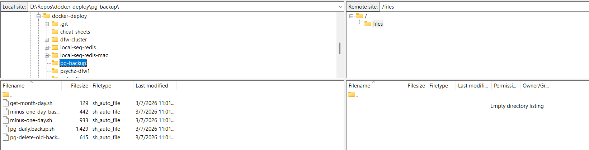

# Migrage Postgres Db

## 1. [Setup FTP](ftp-setup.md)

(if has not already been done)

## 2. [Setup Azure BlobFuse](azure-blob-fuse.md)

## 3. Install Postgres DB

### a) Add the PostgreSQL Repository

```bash
# Install prerequisites
sudo apt install -y postgresql-common ca-certificates curl

# Run the official setup script to add the PGDG repo
sudo /usr/share/postgresql-common/pgdg/apt.postgresql.org.sh
```

### b) Install PostgreSQL 18

```bash
# Update your package list
sudo apt update

# Install the server, client, and common extensions
sudo apt install -y postgresql-18 postgresql-contrib-18
```

### c) Verify Installation

```bash
sudo systemctl status postgresql
```

### d) Edit postgres.conf

Use [pgtune](https://pgtune.leopard.in.ua/?dbVersion=18&osType=linux&dbType=web&cpuNum=4&totalMemory=32&totalMemoryUnit=GB&connectionNum=&hdType=ssd) to generate proper postgres.conf settings.

### e) Edit pg_hba.conf

```
# Database administrative login by Unix domain socket
local   all             postgres                                peer

# TYPE  DATABASE        USER            ADDRESS                 METHOD

# "local" is for Unix domain socket connections only
local   all             all                                     peer
# IPv4 local connections:
host    all             all             127.0.0.1/32            scram-sha-256
# IPv6 local connections:
host    all             all             ::1/128                 scram-sha-256
# Allow replication connections from localhost, by a user with the
# replication privilege.
local   replication     all                                     peer
host    replication     all             127.0.0.1/32            scram-sha-256
host    replication     all             ::1/128                 scram-sha-256

# Allow casa connection
host    all             all             187.190.187.52/24       trust

# Allow vacation connection
host    all             all             187.189.198.209/24      trust

# Connection from app server
host    all             all             199.71.214.49/24        trust
```

### f) Open port 5432

```bash
sudo ufw allow 5432/tcp
```

### g) Restart postgres

```bash
sudo systemctl restart postgresql
```

Check the logs to ensure everything initialized correctly:

```bash
sudo tail -f /var/log/postgresql/postgresql-18-main.log
```

### h) Set the postgres user password

First, switch to the system's postgres user and enter the interactive terminal:

```bash
sudo -i -u postgres
psql
```

Once you see the postgres=# prompt, run the following SQL command (replace 'your_new_password' with a strong password):

```bash
ALTER USER postgres WITH PASSWORD 'your_new_password';
```

### i) Check connection with Datagrip


## 3. Migrate Postgres Data

### d) Stop the PostgreSQL Service

```bash
sudo systemctl stop postgresql
```

### e) Prepare the Data Directory

```bash
# Move the existing data to a backup folder just in case
sudo mv /var/lib/postgresql/18/main /var/lib/postgresql/18/main_old


# Create a fresh, empty directory
sudo mkdir -p /var/lib/postgresql/18/main
chmod 700 /var/lib/postgresql/18/main
```

### f) Extract the Backup

```bash
# Assuming base.tar.gz is in your current directory
sudo tar -xzvf base.tar.gz -C /var/lib/postgresql/18/main/
```

### g) Extract it into the pg_wal Directory

```bash
# Assuming /var/lib/postgresql/18/main is your PGDATA
tar -xzvf /path/to/backup/pg_wal.tar.gz -C /var/lib/postgresql/18/main/pg_wal/
```

### g) Fix Permissions

```bash
# Change ownership to the postgres user
sudo chown -R postgres:postgres /var/lib/postgresql/18/main/
sudo chmod 700 /var/lib/postgresql/18/main/

sudo chown -R postgres:postgres /var/lib/postgresql/18/main/pg_wal
sudo chmod 700 /var/lib/postgresql/18/main/pg_wal
```

### i) Start the Server

```bash
sudo systemctl start postgresql
```

Check the logs to ensure everything initialized correctly:

```bash
sudo tail -f /var/log/postgresql/postgresql-18-main.log
```

## 4. Migrate backup scripts to the new server



### a) create scripts directory

```bash
sudo mkdir /usr/bin/pg-scripts
sudo cp /home/brando/ftp/files/*  /usr/bin/pg-scripts
```

### b) conifgure crontab

```bash
0 3 * * * /bin/bash /usr/bin/pg-scripts/pg-daily.backup.sh
@reboot sudo blobfuse /mnt/pgbackups --tmp-path=/tmp/pgbackups  --config-file=/etc/fuse_azure_connection.yml
```
